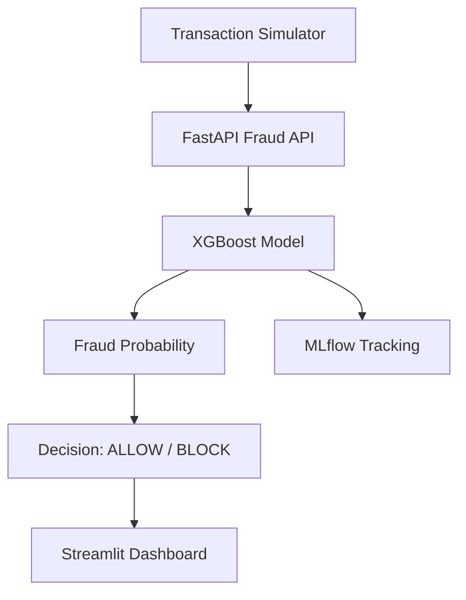

Live Deployment: https://ai-fraud-detection-platform-1.onrender.com/

# AI Fraud Detection Platform


A production-style **real-time fraud detection system** built with an end-to-end ML pipeline, model tracking, a live inference API, and an interactive dashboard.

---

## Live Deployment

**Frontend Dashboard:** https://ai-fraud-detection-platform-1.onrender.com/  

**Backend API:** `https://ai-fraud-detection-platform.onrender.com`  
**API Docs:** `https://ai-fraud-detection-platform.onrender.com/docs`

---

## Purpose of Building This

This project was built to simulate a real fintech-grade fraud detection workflow where:

- transaction data is processed in real time,
- an ML model scores fraud risk,
- suspicious activity is flagged instantly,
- and live analytics are shown through a dashboard.

It is designed to demonstrate practical skills in:

- machine learning,
- MLOps,
- backend engineering,
- deployment,
- and real-time monitoring.

---

## Key Features

- **Real-time fraud scoring** using an XGBoost classifier.
- **FastAPI inference service** for low-latency prediction requests.
- **Live Streamlit dashboard** for monitoring risk scores and flagged transactions.
- **MLflow experiment tracking** to store metrics, parameters, and model artifacts.
- **Transaction simulator** to generate live traffic for testing the pipeline.
- **Dockerized deployment** for reproducible local and cloud execution.
- **Cloud deployment on Render** for public access.

---

## Architecture



---

## Screenshots

### 1) Live Fraud Monitoring Dashboard


### 2) MLflow Experiment Tracking


### 3) Render Deployment Logs


---

## Tech Stack

| Layer | Technologies |
|---|---|
| Frontend / Dashboard | Streamlit |
| Backend API | FastAPI, Uvicorn |
| ML Model | XGBoost, scikit-learn |
| Data Handling | Pandas, NumPy |
| Experiment Tracking | MLflow |
| Containerization | Docker, Docker Compose |
| Cloud Deployment | Render |
| HTTP Communication | Requests |
| Configuration | python-dotenv |

---

## Model & Metrics

| Metric | Value |
|---|---:|
| ROC-AUC | **0.9750** |
| Fraud Recall | **0.76** |
| Precision (Fraud Class) | **0.94** |
| Training Time | ~8.9s |
| Decision Threshold | 0.80 |

---

## Project Structure

```text
AI-Fraud-Detection-Platform/
├── backend/
│   ├── api/
│   └── training/
├── monitoring/
├── scripts/
├── models/
├── docker/
├── requirements.txt
├── docker-compose.yml
└── README.md
```

---

## How It Works

1. A transaction is generated by the simulator.
2. The transaction is sent to the FastAPI `/predict` endpoint.
3. The API converts input into the feature vector expected by the model.
4. The XGBoost model returns a fraud probability.
5. The result is displayed on the dashboard.
6. MLflow stores the experiment parameters and performance metrics.

---

## API Example

### Request

```json
{
  "amount": 1200,
  "transaction_velocity": 6,
  "merchant_risk": 0.8,
  "device_score": 0.3
}
```

### Response

```json
{
  "fraud_probability": 0.42,
  "decision": "ALLOW"
}
```

---

## Local Development

### 1. Create virtual environment
```bash
python -m venv venv
```

### 2. Activate it
```bash
venv\Scripts\activate
```

### 3. Install dependencies
```bash
pip install -r requirements.txt
```

### 4. Run API
```bash
uvicorn backend.api.main:app --reload
```

### 5. Run dashboard
```bash
streamlit run monitoring/dashboard.py
```

### 6. Run simulator
```bash
python scripts/transaction_simulator.py
```

---

## Deployment Notes

- Backend is deployed on **Render** as a web service.
- Dashboard is also deployed separately as a Streamlit web service.
- Make sure `fraud_model.pkl` is available during deployment.
- `models/fraud_model.pkl` is required for inference.

---

## Why This Project Stands Out

This is not just a notebook demo. It includes:

- a training pipeline,
- model tracking,
- a live prediction API,
- a UI dashboard,
- real-time simulation,
- and cloud deployment.

That makes it a strong portfolio project for **ML Engineer**, **Backend Engineer**, and **MLOps** roles.

---

## GitHub / Links

- **Repository:** https://github.com/Ayushb1234/AI-Fraud-Detection-Platform
- **Live Dashboard:** https://ai-fraud-detection-platform-1.onrender.com/


